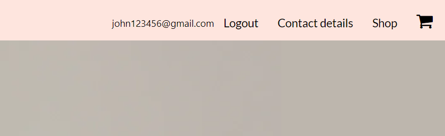
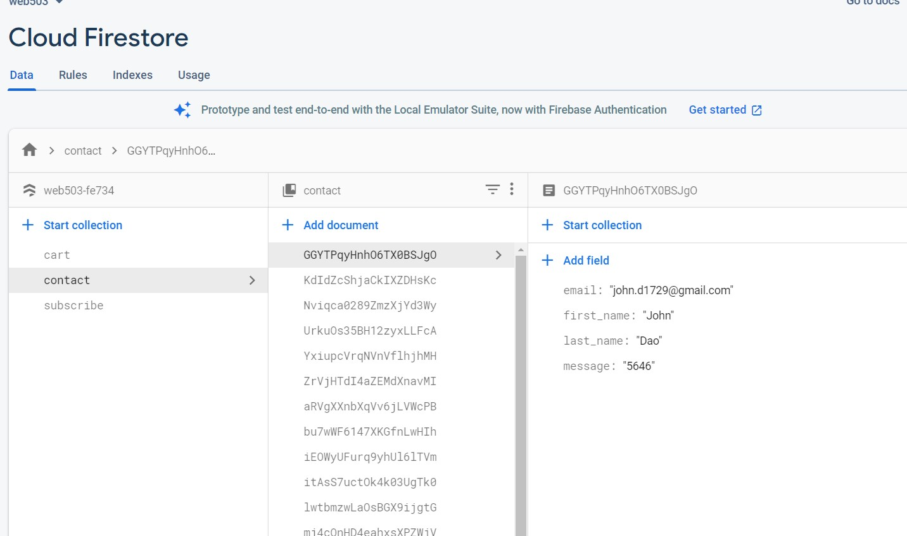

Journal

The assignment 3 webpage is the improvement of second assignment static website project.

While building the website to be dynamic, I have worked more with JavaScript to create and improve the webstore functions.

I gained experience with JavaScript though this project but the most important benefit would be the ability to work with Firebase and Materialize

For Firebase, I learn to work with Firebase Authentication service and cloud Firestore database which work on NoSQL. I was really new to the framework and with less than one year experience in the field, it is hard to understand the documentation regarding Firebase services but with Ali's support and lot of trial and errors, I worked out the sign up and login with email authentication of Firebase to allow the webpage to remember user throughout their browsing time. Furthermore, I also can store the information input from user such as contact details and subscribe emails though Firestore. It is a good starting point for me to improve in the future as Cloud technology is growing and improving. 

Authentication function

data store in database

For Materialize 

The library is a great help to build any websites from scrap but with my existing webpage, there are many conflict between the existing styling and the new button functions such as login and signup. In order to fix the issue, I need to check the function of each build in class and id name. Furthermore, there are some functions which is not suitable for the webpage due to integrate with materialize which would require some changes and adaptation. After working with materialize, I gain more experiences with working  with libraries and found their benefits in creating website.

Local storage 

Although the function allows the browser to store data quicker without internet connection while providing less security options and it could be removed though some cleaning application. I applied the local storage for adding item to cart as it will save the data travel between the server and client machine.

Reference

https://materializecss.com/modals.html

https://firebase.google.com/docs/firestore/manage-data/structure-data